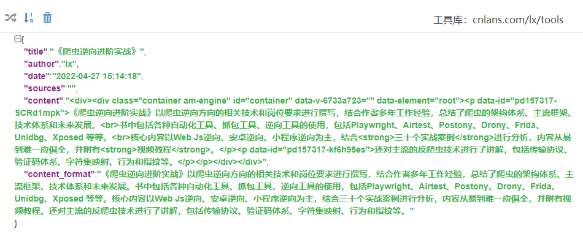

# lxparse

用于解析列表页链接和提取详情页内容的库

A library for intelligently parsing list page links and details page contents

---

## 项目背景

现有2000个政企网站信源，要短时间实现动态监测。

手写时即要查看网站类型又要分析数据接口，然后配置解析规则，人都看麻了。所以写一个自动提取列表页链接的方法。

奈何国内的网站不止由一千个哈姆雷特开发，几乎不存在通用的解析方法，只能说尽量让列表页链接提取更便捷一些。

lxparse中列表页解析借助了readability的主体抽取方法，详情页解析引用了gen的一些正则匹配方法。

---

## 实现逻辑

#### 列表页

1、提取列表页主体，删除html中的无关标签，主要以a标签聚焦程度为评估标准

2、通过xpath规则筛选主体中存在的a标签，以h、ul/li、tr/td 为主，返回链接数组

3、通过余弦公式计算数组中所有url的相似度，保留相似度较高的url，返回链接数组

4、从数组中再次过滤，保留符合规则的链接

#### 详情页

- 标题、作者、来源：以常见规则匹配，并筛选和评估最优解
- 时间：以常见规则和正文内容匹配，经过处理和验证后返回时间格式
- 正文：readability的主体抽取方法，返回带标签和格式化的正文内容

 ---

## 使用方法
安装： pip install lxparse

调用：
```python
from lxparse import LxParse
lx = LxParse()

list_html = ""
lx.parse_list(list_html)
# 指定解析规则
lx.parse_list(list_html,xpath_list='/div[@id="lx"]/a')

detail_html = ""
lx.parse_detail(detail_html)
# 指定解析规则,不声明则使用默认规则
xpath_item = {
    'xpath_title':'',
    'xpath_source':'',
    'xpath_date':'',
    'xpath_author':'',
    'xpath_content':'',
}
lx.parse_detail(detail_html,item=xpath_item)
```

parse_detail 返回：



---

## 测试代码
- demo文件中分别有列表页和详情页的解析示例
- 将html保存本地后，经测试今日头条、新浪新闻、百度资讯、网易新闻、腾讯新闻等可正常解析。

---

## 备注
- 使用lxparse解析库解析时，如有解析异常的可手动指定解析规则。
- 测试用例不多，如有问题麻烦提issues一起优化。
- 或者关注公众号《Pythonlx》，获取群聊二维码，一起交流学习


